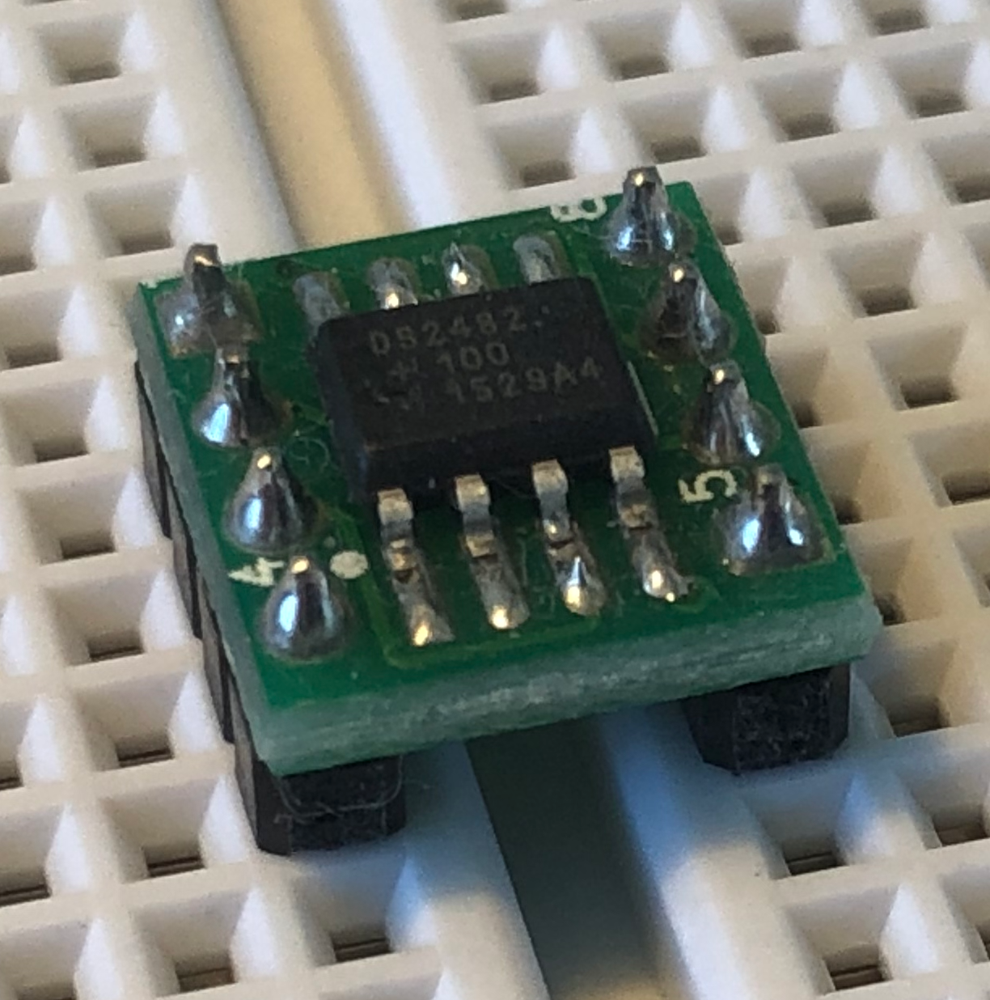

# `one-wire-ds2482`

This crate provides a driver for the DS2482, a I2C to 1-wire bridge.
It is an implementation of the `OneWire` trait from the [`one-wire-hal`](https://github.com/bartweber/one-wire-hal)
crate.

> [!NOTE]  
> This project is a work in progress and might not yet ready for use. This crate is not yet published on crates.io.



The particular device used for implementation is the DS2482-100, but the driver should work with other devices in the
DS2482 family.

Datasheet: [DS2482-100](https://datasheets.maximintegrated.com/en/ds/DS2482-100.pdf)

## Usage

Setup the one-wire bus with the DS2482 and search for devices:

```rust
// setup one-wire bus
let mut ds2482 = OneWireDS2482::new(i2c, 0x18);
ds2482.ds2482_device_reset().unwrap();
ds2482.ds2482_write_config(0b0001).unwrap();
let mut one_wire = ds2482;

// search for devices
let mut devices = one_wire.devices(delay);
```

## To Do

- [ ] Write tests for `OneWireDS2482`
- [ ] Publish the crate
- [ ] Add documentation
- [x] Add working examples for popular devices like the DS18B20
- [ ] Update `cortex-m` dev dependency as soon as it is compatible with `embedded-hal:1.0`
- [ ] Add github actions for CI
- [ ] Add `async` feature